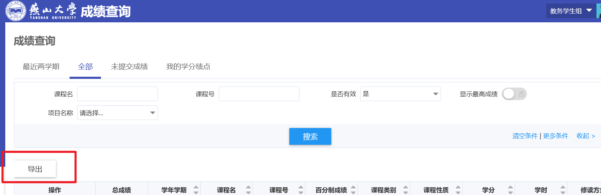
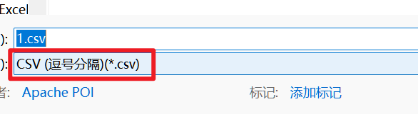

# YSU GPA 计算器

本工具用于根据燕山大学教务系统导出的成绩 CSV 文件，自动计算加权平均学分绩点（GPA）。

## 功能简介
- 只统计主修培养方案内课程的正考成绩。
- 学位课学分和绩点按 1.2 倍计入。
- 支持百分制、等级制自动转换绩点。
- 兼容教务导出的原始 CSV 文件。

## 使用方法

### 1. 准备成绩文件

1. 请从[教务系统](http://jwxt.ysu.edu.cn/)-成绩查询-全部 导出成绩单，保存为 CSV 文件（如 `gpa.csv`）。



2. 另存为csv文件



### 2. 运行程序
在命令行中运行：

```sh
python main.py -f <你的成绩文件.csv>
```

例如：

```sh
python main.py -f gpa.csv
```

### 3. 参数说明
- `-f` 或 `--file`：指定 CSV 成绩文件路径（必填）。

### 4. 输出示例
```
加权平均学分绩点（GPA）：3.9876
```

## 绩点换算规则

| 百分制 | 等级 | 绩点 |
|--------|------|------|
| 97-100 | A+   | 4.5  |
| 93-96  | A    | 4.3  |
| 89-92  | A-   | 4.0  |
| 85-88  | B+   | 3.8  |
| 81-84  | B    | 3.4  |
| 77-80  | B-   | 3.0  |
| 73-76  | C+   | 2.6  |
| 69-72  | C    | 2.2  |
| 65-68  | C-   | 1.8  |
| 60-64  | D    | 1.2  |
| 40-59  | F    | 0    |
| 0-39   | F-   | 0    |

## GPA 计算公式

$$
\text{加权平均学分绩点} = 
\frac{\sum \left[ (\text{非学位课程绩点} \times \text{非学位课程学分}) + (\text{学位课程绩点} \times \text{学位课程学分}) \times 1.2 \right]}
{\sum (\text{非学位课程学分} + \text{学位课程学分} \times 1.2)}
$$

## 注意事项
- 仅统计“主修培养方案内课程”的“正考成绩”。
- 课程性质、是否学位课等信息以 CSV 文件为准。
- 若无有效课程，将提示“无法计算GPA”。

---
如有问题请联系开发者。
